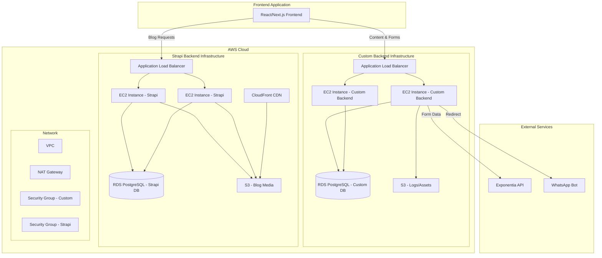

# Design Document

## Overview

This design document outlines the architecture for a dual-backend system consisting of:

1. **Custom Business + Content Backend** - Node.js/Express/PostgreSQL service handling business logic (forms, third-party API integration) and website content management (all pages except blogs)
2. **Strapi Backend** - Headless CMS strictly limited to blog content management

Both services are independently deployable, scalable, and maintain clear API boundaries. The frontend consumes both services through well-defined REST APIs.

### Design Principles

- **Separation of Concerns**: Custom Backend handles business logic and content; Strapi handles blogs only
- **Independent Scalability**: Each service can scale independently based on load
- **Fail-Safe**: Failure in one service does not affect the other
- **API-First**: Clean, versioned REST APIs for frontend consumption
- **Stateless**: Both backends are stateless for horizontal scaling
- **Cloud-Native**: Designed for AWS deployment with managed services

## Architecture

### High-Level Architecture Diagram



### Service Boundaries

**Custom Backend Responsibilities:**
- Content API for buyer landing, seller landing, about, contact, home pages
- Form submission handling (callback, broker requests)
- Integration with Exponentia API
- Retry logic and error handling
- Request/response logging
- Submission status tracking
- WhatsApp bot redirect logic

**Strapi Backend Responsibilities:**
- Blog post CRUD operations (admin only)
- Blog listing and detail APIs (public read)
- Blog category management
- Blog author management
- Blog media upload and storage
- Blog SEO metadata

### Technology Stack

**Custom Backend:**
- Runtime: Node.js 18+ LTS
- Framework: Express.js 4.x
- Database: PostgreSQL 15+
- ORM: Sequelize or Prisma
- Validation: Joi or Zod
- HTTP Client: Axios
- Logging: Winston
- Process Manager: PM2

**Strapi Backend:**
- Runtime: Node.js 18+ LTS
- Framework: Strapi 4.x
- Database: PostgreSQL 15+
- Upload Provider: @strapi/provider-upload-aws-s3
- Process Manager: PM2

**AWS Infrastructure:**
- Compute: EC2 t3.medium (scalable)
- Database: RDS PostgreSQL Multi-AZ
- Storage: S3 Standard
- Load Balancing: Application Load Balancer
- CDN: CloudFront (Strapi media)
- Networking: VPC, NAT Gateway, Security Groups

## Components and Interfaces

### Custom Backend Components

#### 1. API Layer

**Routes** (`/src/routes/`)
- `content.routes.js` - Content endpoints
- `forms.routes.js` - Form submission endpoints
- `health.routes.js` - Health check endpoint

**Controllers** (`/src/controllers/`)
- `ContentController` - Handles content retrieval requests
- `CallbackFormController` - Handles callback form submissions
- `BrokerFormController` - Handles broker form submissions
- `StatusController` - Handles submission status queries

#### 2. Service Layer

**Services** (`/src/services/`)
- `ContentManager` - Manages content retrieval and caching
- `FormProcessor` - Validates and processes form submissions
- `ExponentiaAdapter` - Handles Exponentia API communication
- `RetryQueue` - Manages failed API call retries
- `LoggingService` - Centralized logging
- `WhatsAppRedirect` - Handles WhatsApp bot redirect logic

#### 3. Data Layer

**Models** (`/src/models/`)
- `ContentPage` - Content page metadata
- `ContentSection` - Page sections with content
- `CallbackRequest` - Callback form submissions
- `BrokerRequest` - Broker form submissions
- `IntegrationLog` - API request logs
- `ResponseLog` - API response logs
- `ErrorLog` - Error tracking
- `SubmissionStatus` - Form submission state
- `IntegrationConfig` - External API configuration

**Repositories** (`/src/repositories/`)
- `ContentRepository` - Content data access
- `FormRepository` - Form data access
- `LogRepository` - Log data access

#### 4. Middleware

**Middleware** (`/src/middleware/`)
- `errorHandler` - Global error handling
- `requestLogger` - Request logging
- `validator` - Request validation
- `rateLimiter` - Rate limiting protection
- `cors` - CORS configuration

#### 5. Helpers

**Helpers** (`/src/helpers/`)
- `responseFormatter` - Standardized API responses
- `errorFormatter` - Standardized error responses
- `cacheManager` - Content caching logic
- `retryHelper` - Exponential backoff retry logic

### Strapi Backend Components

#### 1. Content Types

**Blog Content Types** (`/src/api/`)
- `blog-post` - Blog post content type
  - Fields: title, slug, content, excerpt, featured_image, seo_title, seo_description, published_at
  - Relations: category (many-to-one), author (many-to-one)
- `blog-category` - Blog category content type
  - Fields: name, slug, description
- `blog-author` - Blog author content type
  - Fields: name, bio, avatar, social_links

#### 2. Custom Controllers

**Controllers** (`/src/api/*/controllers/`)
- Custom query logic for filtering and pagination
- Custom response formatting

#### 3. Upload Provider

**Configuration** (`/config/plugins.js`)
- AWS S3 upload provider configuration
- Bucket, region, credentials setup

#### 4. Permissions

**Roles & Permissions** (`/config/`)
- Public role: Read access to all blog content types
- Authenticated role: Full CRUD on blog content types

### API Contracts

#### Custom Backend APIs

**Base URL:** `https://api.yourdomain.com/api/v1`

**Content Endpoints (GET):**

```
GET /content/buyer-landing
Response: {
  "success": true,
  "data": {
    "page": "buyer-landing",
    "sections": [
      {
        "id": "hero",
        "type": "hero",
        "title": "Find Your Dream Home",
        "subtitle": "...",
        "cta_text": "Get Started",
        "cta_link": "/contact"
      },
      {
        "id": "features",
        "type": "features",
        "items": [...]
      }
    ]
  }
}

GET /content/seller-landing
GET /content/about
GET /content/contact
GET /content/home
```

**Form Endpoints (POST):**

```
POST /forms/callback
Request: {
  "name": "John Doe",
  "phone": "+1234567890",
  "email": "john@example.com",
  "preferred_time": "morning"
}
Response: {
  "success": true,
  "data": {
    "submission_id": "uuid",
    "status": "submitted",
    "message": "We'll call you back soon"
  }
}

POST /forms/broker
Request: {
  "name": "Jane Smith",
  "phone": "+1234567890",
  "email": "jane@example.com",
  "property_type": "apartment",
  "location": "Downtown"
}
Response: {
  "success": true,
  "data": {
    "submission_id": "uuid",
    "status": "submitted",
    "redirect_url": "https://wa.me/..."
  }
}

GET /forms/broker/status/:id
Response: {
  "success": true,
  "data": {
    "submission_id": "uuid",
    "status": "completed",
    "submitted_at": "2025-11-16T10:30:00Z",
    "processed_at": "2025-11-16T10:30:05Z"
  }
}
```

#### Strapi Backend APIs

**Base URL:** `https://blog.yourdomain.com/api`

**Blog Endpoints (GET):**

```
GET /blogs?pagination[page]=1&pagination[pageSize]=10
Response: {
  "data": [
    {
      "id": 1,
      "attributes": {
        "title": "Blog Post Title",
        "slug": "blog-post-title",
        "excerpt": "...",
        "content": "...",
        "featured_image": {...},
        "published_at": "2025-11-16T10:00:00Z",
        "category": {...},
        "author": {...}
      }
    }
  ],
  "meta": {
    "pagination": {...}
  }
}

GET /blogs/:slug?populate=*
Response: {
  "data": {
    "id": 1,
    "attributes": {
      "title": "Blog Post Title",
      "slug": "blog-post-title",
      "content": "Full blog content...",
      "featured_image": {...},
      "seo_title": "...",
      "seo_description": "...",
      "category": {...},
      "author": {...}
    }
  }
}

GET /blog-categories
Response: {
  "data": [
    {
      "id": 1,
      "attributes": {
        "name": "Real Estate Tips",
        "slug": "real-estate-tips",
        "description": "..."
      }
    }
  ]
}

GET /blog-authors
Response: {
  "data": [
    {
      "id": 1,
      "attributes": {
        "name": "John Expert",
        "bio": "...",
        "avatar": {...},
        "social_links": {...}
      }
    }
  ]
}
```

## Data Models

### Custom Backend Database Schema

**Table: content_pages**
```sql
CREATE TABLE content_pages (
  id UUID PRIMARY KEY DEFAULT gen_random_uuid(),
  page_key VARCHAR(100) UNIQUE NOT NULL,
  title VARCHAR(255) NOT NULL,
  description TEXT,
  is_active BOOLEAN DEFAULT true,
  created_at TIMESTAMP DEFAULT CURRENT_TIMESTAMP,
  updated_at TIMESTAMP DEFAULT CURRENT_TIMESTAMP
);
```

**Table: content_sections**
```sql
CREATE TABLE content_sections (
  id UUID PRIMARY KEY DEFAULT gen_random_uuid(),
  page_id UUID REFERENCES content_pages(id) ON DELETE CASCADE,
  section_key VARCHAR(100) NOT NULL,
  section_type VARCHAR(50) NOT NULL,
  content JSONB NOT NULL,
  sort_order INTEGER DEFAULT 0,
  is_active BOOLEAN DEFAULT true,
  created_at TIMESTAMP DEFAULT CURRENT_TIMESTAMP,
  updated_at TIMESTAMP DEFAULT CURRENT_TIMESTAMP,
  UNIQUE(page_id, section_key)
);
```

**Table: cta_callback_requests**
```sql
CREATE TABLE cta_callback_requests (
  id UUID PRIMARY KEY DEFAULT gen_random_uuid(),
  name VARCHAR(255) NOT NULL,
  phone VARCHAR(20) NOT NULL,
  email VARCHAR(255),
  preferred_time VARCHAR(50),
  status VARCHAR(50) DEFAULT 'pending',
  exponentia_response JSONB,
  created_at TIMESTAMP DEFAULT CURRENT_TIMESTAMP,
  updated_at TIMESTAMP DEFAULT CURRENT_TIMESTAMP
);
```

**Table: cta_broker_requests**
```sql
CREATE TABLE cta_broker_requests (
  id UUID PRIMARY KEY DEFAULT gen_random_uuid(),
  name VARCHAR(255) NOT NULL,
  phone VARCHAR(20) NOT NULL,
  email VARCHAR(255),
  property_type VARCHAR(100),
  location VARCHAR(255),
  status VARCHAR(50) DEFAULT 'pending',
  exponentia_response JSONB,
  whatsapp_redirect_url TEXT,
  created_at TIMESTAMP DEFAULT CURRENT_TIMESTAMP,
  updated_at TIMESTAMP DEFAULT CURRENT_TIMESTAMP
);
```

**Table: integration_logs**
```sql
CREATE TABLE integration_logs (
  id UUID PRIMARY KEY DEFAULT gen_random_uuid(),
  request_type VARCHAR(100) NOT NULL,
  request_payload JSONB NOT NULL,
  endpoint VARCHAR(255) NOT NULL,
  http_method VARCHAR(10) NOT NULL,
  created_at TIMESTAMP DEFAULT CURRENT_TIMESTAMP
);
```

**Table: response_logs**
```sql
CREATE TABLE response_logs (
  id UUID PRIMARY KEY DEFAULT gen_random_uuid(),
  integration_log_id UUID REFERENCES integration_logs(id),
  status_code INTEGER NOT NULL,
  response_payload JSONB,
  response_time_ms INTEGER,
  created_at TIMESTAMP DEFAULT CURRENT_TIMESTAMP
);
```

**Table: error_logs**
```sql
CREATE TABLE error_logs (
  id UUID PRIMARY KEY DEFAULT gen_random_uuid(),
  integration_log_id UUID REFERENCES integration_logs(id),
  error_message TEXT NOT NULL,
  error_stack TEXT,
  retry_count INTEGER DEFAULT 0,
  created_at TIMESTAMP DEFAULT CURRENT_TIMESTAMP
);
```

**Table: submission_status**
```sql
CREATE TABLE submission_status (
  id UUID PRIMARY KEY DEFAULT gen_random_uuid(),
  submission_id UUID NOT NULL,
  submission_type VARCHAR(50) NOT NULL,
  status VARCHAR(50) NOT NULL,
  submitted_at TIMESTAMP NOT NULL,
  processed_at TIMESTAMP,
  metadata JSONB,
  created_at TIMESTAMP DEFAULT CURRENT_TIMESTAMP,
  updated_at TIMESTAMP DEFAULT CURRENT_TIMESTAMP
);
```

**Table: integration_config**
```sql
CREATE TABLE integration_config (
  id UUID PRIMARY KEY DEFAULT gen_random_uuid(),
  config_key VARCHAR(100) UNIQUE NOT NULL,
  config_value JSONB NOT NULL,
  is_active BOOLEAN DEFAULT true,
  created_at TIMESTAMP DEFAULT CURRENT_TIMESTAMP,
  updated_at TIMESTAMP DEFAULT CURRENT_TIMESTAMP
);
```

### Strapi Database Schema

Strapi auto-generates tables, but custom content types will create:

**Table: blog_posts**
- id, title, slug, content, excerpt
- featured_image (relation to uploads)
- seo_title, seo_description
- published_at, created_at, updated_at
- category_id (foreign key)
- author_id (foreign key)

**Table: blog_categories**
- id, name, slug, description
- created_at, updated_at

**Table: blog_authors**
- id, name, bio
- avatar (relation to uploads)
- social_links (JSON)
- created_at, updated_at

**Table: uploads** (Strapi built-in)
- id, name, url, mime, size
- provider (aws-s3)
- created_at, updated_at

## Error Handling

### Custom Backend Error Handling

**Error Types:**
1. **Validation Errors** (400) - Invalid request data
2. **Not Found Errors** (404) - Resource not found
3. **Integration Errors** (502) - Exponentia API failures
4. **Server Errors** (500) - Internal server errors

**Error Response Format:**
```json
{
  "success": false,
  "error": {
    "code": "VALIDATION_ERROR",
    "message": "Invalid phone number format",
    "details": {
      "field": "phone",
      "constraint": "E.164 format required"
    }
  }
}
```

**Retry Strategy:**
- Maximum 3 retry attempts for Exponentia API calls
- Exponential backoff: 1s, 2s, 4s
- Log each retry attempt
- Return error after final failure

**Fallback Behavior:**
- Store failed submissions in database
- Return user-friendly error message
- Queue for manual review
- Send alert to monitoring system

### Strapi Backend Error Handling

**Error Types:**
1. **Validation Errors** (400) - Invalid content data
2. **Not Found Errors** (404) - Blog post not found
3. **Permission Errors** (403) - Unauthorized access
4. **Server Errors** (500) - Internal errors

**Error Response Format:**
```json
{
  "data": null,
  "error": {
    "status": 404,
    "name": "NotFoundError",
    "message": "Blog post not found",
    "details": {}
  }
}
```

## Testing Strategy

### Custom Backend Testing

**Unit Tests:**
- Service layer logic (FormProcessor, ExponentiaAdapter, RetryQueue)
- Helper functions (retry logic, response formatting)
- Validation schemas
- Target: 80% code coverage

**Integration Tests:**
- API endpoint testing (content, forms, status)
- Database operations
- External API mocking (Exponentia)
- Target: All critical paths covered

**E2E Tests:**
- Form submission flow
- Content retrieval flow
- Status check flow
- Target: Happy path + error scenarios

**Tools:**
- Jest for unit/integration tests
- Supertest for API testing
- Nock for HTTP mocking

### Strapi Backend Testing

**Content Type Tests:**
- Validate blog post creation
- Validate relationships (category, author)
- Validate media upload

**API Tests:**
- Public read access
- Admin write access
- Pagination and filtering

**Tools:**
- Jest for unit tests
- Strapi testing utilities
- Supertest for API testing

### Performance Testing

**Load Testing:**
- Content API: 1000 req/s
- Form API: 100 req/s
- Blog API: 500 req/s

**Tools:**
- Apache JMeter or k6
- AWS CloudWatch for monitoring

## Deployment Architecture

### AWS Infrastructure Setup

**VPC Configuration:**
- CIDR: 10.0.0.0/16
- Public Subnets: 10.0.1.0/24, 10.0.2.0/24 (Multi-AZ)
- Private Subnets: 10.0.10.0/24, 10.0.11.0/24 (Multi-AZ)
- NAT Gateway in public subnet for outbound traffic

**Security Groups:**

*Custom Backend SG:*
- Inbound: 443 (HTTPS) from ALB
- Outbound: 443 (HTTPS) to Exponentia API, 5432 to RDS

*Strapi Backend SG:*
- Inbound: 443 (HTTPS) from ALB
- Outbound: 443 (HTTPS) to S3, 5432 to RDS

*RDS SG:*
- Inbound: 5432 from Custom Backend SG and Strapi Backend SG

**EC2 Configuration:**
- Instance Type: t3.medium (2 vCPU, 4GB RAM)
- AMI: Amazon Linux 2023
- Auto Scaling: Min 2, Max 4 instances per service
- Health Checks: HTTP /health endpoint

**RDS Configuration:**
- Engine: PostgreSQL 15
- Instance Class: db.t3.medium
- Multi-AZ: Yes
- Storage: 100GB GP3, auto-scaling enabled
- Backup: 7-day retention
- Separate databases for Custom and Strapi

**S3 Configuration:**
- Custom Backend: Logs bucket (private)
- Strapi Backend: Media bucket (public-read)
- Versioning: Enabled
- Lifecycle: Archive to Glacier after 90 days

**ALB Configuration:**
- Scheme: Internet-facing
- Listeners: HTTPS (443) with SSL certificate
- Target Groups: Custom Backend, Strapi Backend
- Health Check: /health endpoint, 30s interval

**CloudFront (Strapi Media):**
- Origin: S3 media bucket
- Cache Policy: CachingOptimized
- SSL: CloudFront certificate
- Geo-restriction: None

### Deployment Process

**Custom Backend Deployment:**
1. Build application: `npm run build`
2. Run database migrations: `npm run migrate`
3. Create AMI with application code
4. Update Launch Template
5. Trigger Auto Scaling Group refresh
6. Monitor health checks

**Strapi Backend Deployment:**
1. Build application: `npm run build`
2. Run database migrations: `npm run strapi migrate`
3. Create AMI with application code
4. Update Launch Template
5. Trigger Auto Scaling Group refresh
6. Monitor health checks

### Environment Variables

**Custom Backend:**
```
NODE_ENV=production
PORT=3000
DATABASE_URL=postgresql://...
EXPONENTIA_API_URL=https://...
EXPONENTIA_API_KEY=...
WHATSAPP_BOT_URL=https://...
REDIS_URL=redis://... (for caching)
LOG_LEVEL=info
```

**Strapi Backend:**
```
NODE_ENV=production
PORT=1337
DATABASE_URL=postgresql://...
AWS_ACCESS_KEY_ID=...
AWS_SECRET_ACCESS_KEY=...
AWS_REGION=us-east-1
AWS_BUCKET=strapi-media
ADMIN_JWT_SECRET=...
API_TOKEN_SALT=...
```

### Monitoring and Logging

**CloudWatch Metrics:**
- CPU utilization
- Memory utilization
- Request count
- Error rate
- Response time

**CloudWatch Logs:**
- Application logs
- Access logs
- Error logs

**Alarms:**
- High error rate (> 5%)
- High response time (> 2s)
- Low health check success rate (< 80%)

### CI/CD Pipeline

**Pipeline Stages:**
1. Code checkout
2. Install dependencies
3. Run linting
4. Run unit tests
5. Run integration tests
6. Build application
7. Create AMI
8. Deploy to staging
9. Run E2E tests
10. Deploy to production (manual approval)

**Tools:**
- GitHub Actions or AWS CodePipeline
- AWS CodeBuild
- AWS CodeDeploy

## Security Considerations

**API Security:**
- Rate limiting: 100 req/min per IP
- Input validation on all endpoints
- SQL injection prevention (parameterized queries)
- XSS prevention (sanitize inputs)
- CORS configuration (whitelist frontend domains)

**Data Security:**
- Encryption at rest (RDS, S3)
- Encryption in transit (TLS 1.2+)
- Secrets management (AWS Secrets Manager)
- No sensitive data in logs

**Network Security:**
- Private subnets for EC2 and RDS
- NAT Gateway for outbound traffic
- Security groups with least privilege
- VPC Flow Logs enabled

**Compliance:**
- GDPR considerations for user data
- Data retention policies
- Audit logging for admin actions
