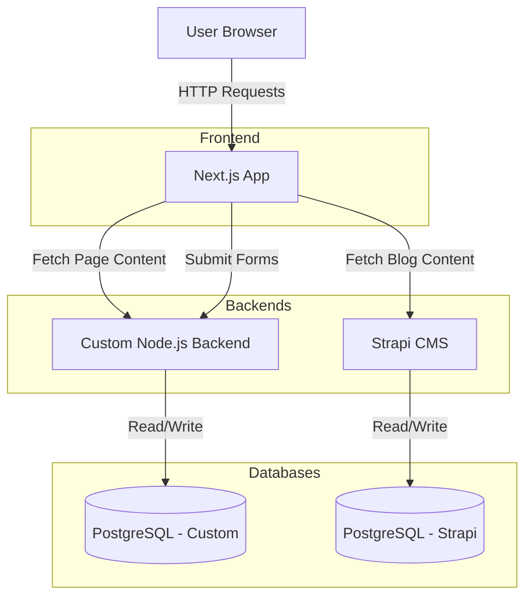

# System Architecture

## Overview
Homeverse is built on a microservices-inspired architecture, separating the frontend presentation layer from the backend business logic and content management systems. This ensures scalability, maintainability, and a clear separation of concerns.

## Components

### 1. Frontend Application (`/frontend`)
*   **Framework**: Next.js 14 (App Router).
*   **Language**: TypeScript.
*   **Styling**: Tailwind CSS.
*   **State Management**: React Hooks, Context API.
*   **Responsibility**:
    *   Renders the user interface.
    *   Fetches content from the Custom Backend and Strapi.
    *   Handles user interactions (forms, navigation).
    *   Optimized for SEO and performance.

### 2. Custom Backend (`/custom-backend`)
*   **Framework**: Node.js with Express.js.
*   **Database**: PostgreSQL (via Sequelize ORM).
*   **Responsibility**:
    *   **API Gateway**: Aggregates content for the frontend.
    *   **Business Logic**: Handles complex operations like form processing, email notifications, and third-party integrations.
    *   **Data Persistence**: Stores form submissions (Callback Requests, Broker Inquiries) and structural page content.
    *   **Security**: Manages API rate limiting, CORS, and input validation.

### 3. Headless CMS (`/strapi-backend`)
*   **Platform**: Strapi v5.
*   **Database**: PostgreSQL.
*   **Responsibility**:
    *   **Content Management**: Allows non-technical users to manage blog posts, authors, and categories.
    *   **Media Management**: Stores and serves images and assets.
    *   **API**: Exposes RESTful endpoints for content consumption.

## Architecture Diagram

## Key Interactions

1.  **Page Load**:
    *   Next.js requests page structure (hero, features, etc.) from the Custom Backend.
    *   Next.js requests dynamic content (latest blog posts) from Strapi.
    *   Next.js merges this data to render the final HTML.

2.  **Form Submission**:
    *   User submits a form (e.g., "Get a Callback").
    *   Next.js sends a POST request to the Custom Backend.
    *   Custom Backend validates the data, saves it to the database, and triggers any necessary workflows (e.g., sending an email).
    *   Custom Backend returns a success/error response to the Frontend.
