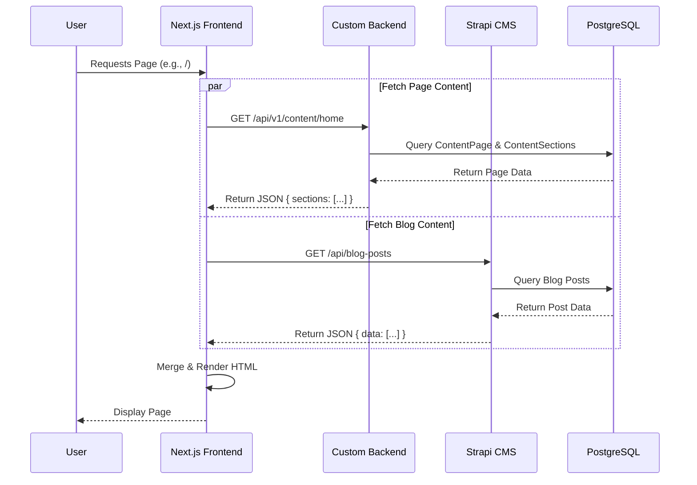
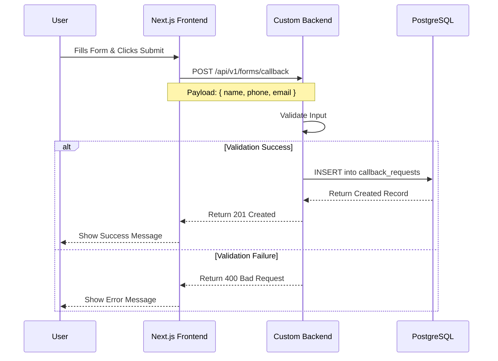

# Data Flows

This document details the flow of data within the Homeverse application, covering content retrieval and form submission processes.

## 1. Content Retrieval Flow

### Overview
The frontend fetches page structure and static content from the **Custom Backend** and dynamic blog content from **Strapi**.

### Flow Diagram


### Data Structures
*   **Page Content (Custom Backend)**:
    ```json
    {
      "success": true,
      "data": {
        "page": "home",
        "sections": [
          {
            "id": "hero-1",
            "type": "hero",
            "title": "Welcome...",
            "sort_order": 1
          },
          ...
        ]
      }
    }
    ```
*   **Blog Content (Strapi)**:
    ```json
    {
      "data": [
        {
          "id": 1,
          "title": "Top 10 Tips...",
          "slug": "top-10-tips",
          ...
        }
      ],
      "meta": { ... }
    }
    ```

## 2. Form Submission Flow

### Overview
When a user submits a form (Callback or Broker Inquiry), the data is sent to the Custom Backend for processing and storage.

### Flow Diagram


### Form Payloads

#### Callback Request
*   **Endpoint**: `/api/v1/forms/callback`
*   **Method**: `POST`
*   **Body**:
    ```json
    {
      "name": "John Doe",
      "phone": "+1234567890",
      "email": "john@example.com" // Optional
    }
    ```

#### Broker Inquiry
*   **Endpoint**: `/api/v1/forms/broker`
*   **Method**: `POST`
*   **Body**:
    ```json
    {
      "name": "Jane Smith",
      "phone": "+1987654321",
      "location": "New York",
      "property_type": "Commercial"
    }
    ```
